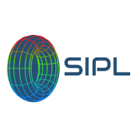
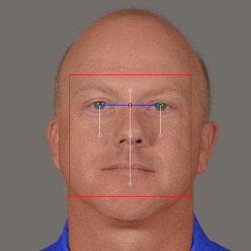

[![Commits][commits-shield]][commits-url]
[![Stargazers][stars-shield]][stars-url]
[![Issues][issues-shield]][issues-url]
[![MIT License][license-shield]][license-url]
[![LinkedIn][linkedin-shield]][linkedin-url]

<!-- PROJECT LOGO -->
 

  

  <h3 align="center">SIPL - Image Processing Library</h3>

  

    A Plug And Play Solution For Working With Images And Image Processing
     
    <a href="https://github.com/MuteJester/Simple_Image_Processing_Library/wiki"><strong>Explore the docs »</strong></a>
     
     
    <a href="https://github.com/MuteJester/Coding_Challenges_Using_SIPL">Created Using SIPL</a>
    ·
    <a href="https://github.com/MuteJester/Simple_Image_Processing_Library/wiki">View Demo</a>
    ·
    <a href="https://github.com/MuteJester/Simple_Image_Processing_Library/issues">Report Bug</a>
    ·
    <a href="https://github.com/MuteJester/Simple_Image_Processing_Library/issues">Request Feature</a>
 
  

<!-- TABLE OF CONTENTS -->
## Table of Contents

* [About the Project](#about-the-project)
  * [Built Using](#built-using)
* [Getting Started](#getting-started)
  * [Notice](#notice)
  * [Installation](#installation)
* [Usage](#usage)
* [Current Features](#current-features)
* [Contributing](#contributing)
* [License](#license)
* [Contact](#contact)

<!-- ABOUT THE PROJECT -->
## About The Project
There are more then a few great Image Handlers and Image Processing librarys available on GitHub, however, I didn't find one that really suit my needs, the need to simply drag a file into my project folder and start coding ,a library with straightforward method names so it can be used without searching to much the web or reading a whole insturction manual so I created this simple plug and play library. I want to create an Image Handaling,Processing and Analysis library so efficient and simple that it'll be the last one you ever need.

Here's why SIPL:
* Your time should be focused on algorithms,developing something amazing,not learning shortened method names of a library
* You shouldn't install a huge amount of external dependencies to your project - SIPL has no external dependencies !
* You should be able to read any code written using SIPL and clrealy understand whats going on from the method names
* You have an understanding on how to use SIPL on one language ? , you know how to use SIPL on all supported languages !

Of course, for the time being the library is still under development so still it will not serve all projects since your needs may be different then what the library currently supports for you language or even at all . functions and features will be added in the near future. You may also suggest changes by forking this repo and creating a pull request or opening an issue.

### Built Using
* [Visual Studio](https://visualstudio.microsoft.com/)
* [Eclipse](https://www.eclipse.org/)
* [Pycharm](https://www.jetbrains.com/pycharm/)

<!-- GETTING STARTED -->
## Getting Started

This is an example of how you may give instructions on setting up your project locally.
To get a local copy up and running follow these simple example steps.

### Notice

* __C++ Version-__
  
  __Version 1.0__
  SIPL can be used just by adding to your project all the header files and CPP files located in the __SIPL Core__ folder.
  including only the core of the library will allow you to use all core features and methods without
  the added functionality of the subclasses.
  the main core provides all needed tools for image processing, analysis, and handling.
  SIPL-C++  works best with __.jpg__  format,
  the infrastructure used to load image binary data
  was recently updated for better performance
  as for now, SIPL uses the [stb load/write lib](https://github.com/nothings/stb) to load image data to memory and
  to write processed data back to drive.
  
    __Version 2.0__
    Faster,Memory Efficient,And Much More User Friendly , SIPL 2.0 Released(30/5/2020) !
    keep in mind instructions for version 1.0 slightly different becuase of updates and upgrades that were made in the 
    core structure.
    The SIPL Pixel Matrix Logic is still the same only method names and calls changed.
    
    To Use Version 2.0 all you need is to drag and drop the SIPL_CPP header files from [Here](https://github.com/MuteJester/Simple_Image_Processing_Library/tree/master/SIPL(C%2B%2B)%202.0)
    to your project folder ,and include __ONLY__  Cpp_SIPL.h, and you are ready to code!

    
    the infrastructure used to load image binary data
    still uses the [stb load/write lib](https://github.com/nothings/stb) to load image data to memory and
    to write processed data back to drive.
    

  visual studio users if getting security error while compiling  
  please add  ___CRT_SECURE_NO_WARNINGS__ to your preprocessor definitions setting 

__!Important!__ all sub-libraries and functionality relay on the Core files always include the core folder first!.

* __Java Version-__

  SIPL can be used by adding to your projects /src folder  the "Image" java class file located under the __Java__ folder.
  adding the the class file will allow you to use all core features and methods without
  the added functionality of the subclasses.
  the main core provides all needed tools for image processing, analysis, and handling
    

* __Python Version-__
  SIPL can be used by adding to your projects folder the "SIPL_Python.py" file located under the __Python__ folder.
  adding the the py file will allow you to import all core features and methods without
  the added functionality of the subclasses.
  the main core provides all needed tools for image processing, analysis, and handling
  

Detailed tutorials about how to work with SIPL can be found in the [wiki](https://github.com/MuteJester/Simple_Image_Processing_Library/wiki) tab of this repository 

### Installation
1. Download The Corresponding Files From The Repository Folder Of Required Language 
* [Python Version](https://github.com/MuteJester/Simple_Image_Processing_Library/tree/master/Python)
* [C++ Version](https://github.com/MuteJester/Simple_Image_Processing_Library/tree/master/SIPL%20Core)
* [Java Version](https://github.com/MuteJester/Simple_Image_Processing_Library/tree/master/Java)
2. Copy All Classes/Files Into Your Projects /src or /main Folder
3. You Are Ready To Code!

<!-- USAGE EXAMPLES -->
## Usage

#### Face Detection (Real-Time Parametric)

SIPL Offers A Real-Time face detection algorithm which is parametric ,meaning theres is no machine learning involved in this spesific algorithm ,it tries to detect a face by color difference stated by the user. The success rate of the algorithm depends on the parameters passed to the function and they are individual for each image!.

#### Image Color Segmentation 

SIPL Offers A Quick Algorithm For Image Color Segmentation Using K Means, useful for color variance reduction

#### Figure Detection

SIPL Offers A Real-Time figure detection algorithm which is parametric like the face detection algorithm ,meaning it will detect figures by user given parameters , different parameters will result in different results !

* _For more Detailed Instructions, please refer to the [User Instructions](https://github.com/MuteJester/Simple_Image_Processing_Library/wiki/)_

## Current Features
 some features may be under development for some languages (java version has all the features stated at all time) 
 ### Basic Image Handling
  * __Loading/Creating/Writing Images__
  * __Cropping/Scaling__
  * __Single Pixel Modification__
  * __Spatial Rotation__
  * __Image View (Using SIPL's Local GUI Window)__
 ### Drawing Functionality 
  * __Shape Drawing (Cirlce,Rectangle,Triangle) - Fill/No-Fill__
  * __Line Drawing__
  * __Text Drawing__
 ### Processing Functionality 
  * __Thresholding__
  * __Color Flooring__
  * __Edge_Detection__
  * __Kernel Convolution__
  * __Image Convolution__
  * __Feature_Matching__
  * __Average Palette Detection__
  * __Image Segmentation__
  * __Image Paddings__
  * __Dithering__
  * __Circle Packing__
  * __Channel Controlling__
  * __Color Space Conversions__
  * __Noise Addition/Creation__
  * __Bit Plane Slicing__
  * __Blob Farming__
  * __Difference Measurement__
  * __Connected Components Labeling__

  ### Image Transformations
  * __Power/Log /Negative Transformations__
  * __Fourier Transformation__
  ### Histogram Functionality
  * __Localy View / Export Channel Histogram__
  * __Histogram Equalization__
  * __Histogram Correction (Linear,Power,Log)__
    ### Image Arithmetics
  * __Addition__
  * __Subtraction__
  * __Multiplication__
  * __Division__
  * __Logic Operations (OR,AND,XOR,NOT,AND-NOT)__
  * __Set Operations (Union,Complement,Intersection)__
  ### Plotting Templates Supported
  * __Scatter Plot__
  * __Bar Plot__
  * __Pie Plot__
  * __Histogram__
  
  ### Mathematical Utilities 
  * __Complex Number Handling__
  * __Matrix Handaling__
  * __Complex Matrix Operations__
  * __Statistical Calculations__
  * __Random Number/Color/Sequance Generation__
    * __Linear Calculations (Distances/Interpolation..)__
  ### Library Local GUI
  * __Frame Refreshing (For Game/ Video / Animation Creation)__
  * __3D Ploting And Interaction__
  * __Image Viewing__
  

<!-- CONTRIBUTING -->
## Contributing

Contributions are what make the open-source community such a powerful place to create new ideas, inspire, and make progress. Any contributions / ideas / requests  you make are **greatly appreciated**.

1. Fork the Project
2. Create your Feature Branch (`git checkout -b feature/GreatIdea`)
3. Commit your changes (`git commit -m 'Add some HelpfulFeature'`)
4. Push to the Branch (`git push origin feature/GreatIdea`)
5. Open a Pull Request

<!-- LICENSE -->
## License

Distributed under the MIT License. See `LICENSE` for more information.

<!-- CONTACT -->
## Contact

Your Name - [Thomas Konstantin]() - thomaskon90@gmail.com

Project Link: [https://github.com/MuteJester/Simple_Image_Processing_Library](Link)

<!-- MARKDOWN LINKS & IMAGES -->
[commits-shield]: https://img.shields.io/github/commit-activity/m/MuteJester/Simple_Image_Processing_Library
[commits-url]: https://github.com/MuteJester/Simple_Image_Processing_Library
[stars-shield]: https://img.shields.io/github/stars/MuteJester/Simple_Image_Processing_Library.svg?style=flat-square
[stars-url]: https://github.com/MuteJester/Simple_Image_Processing_Library/stargazers
[issues-shield]:https://img.shields.io/github/issues/MuteJester/Simple_Image_Processing_Library?style=flat-square
[issues-url]: https://github.com/MuteJester/Simple_Image_Processing_Library/issues
[license-shield]: https://img.shields.io/github/license/MuteJester/Simple_Image_Processing_Library?style=flat-square
[license-url]: https://github.com/MuteJester/Simple_Image_Processing_Library/blob/master/LICENSE
[linkedin-shield]: https://img.shields.io/badge/-LinkedIn-black.svg?style=flat-square&logo=linkedin&colorB=555
[linkedin-url]: https://www.linkedin.com/in/thomas-konstantinovsky-56230117b/

